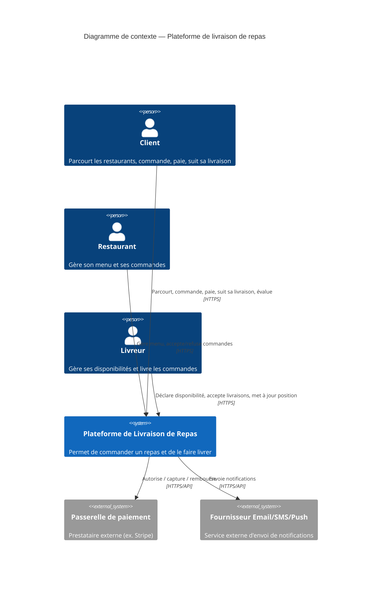
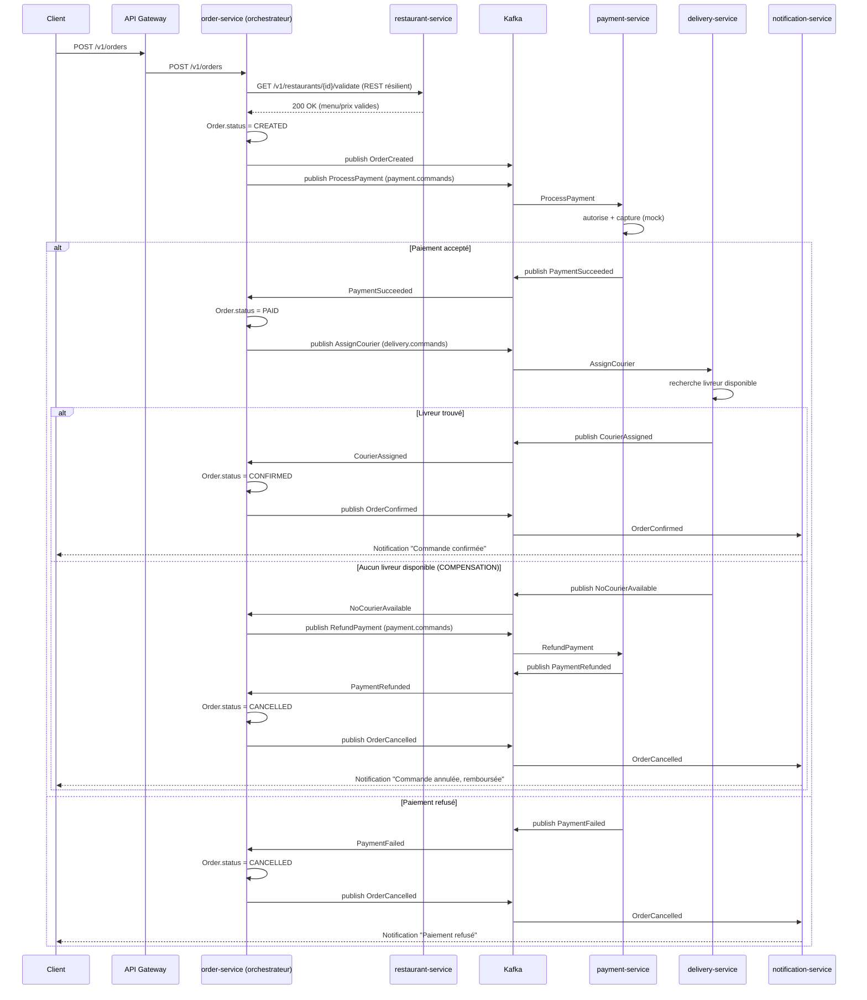
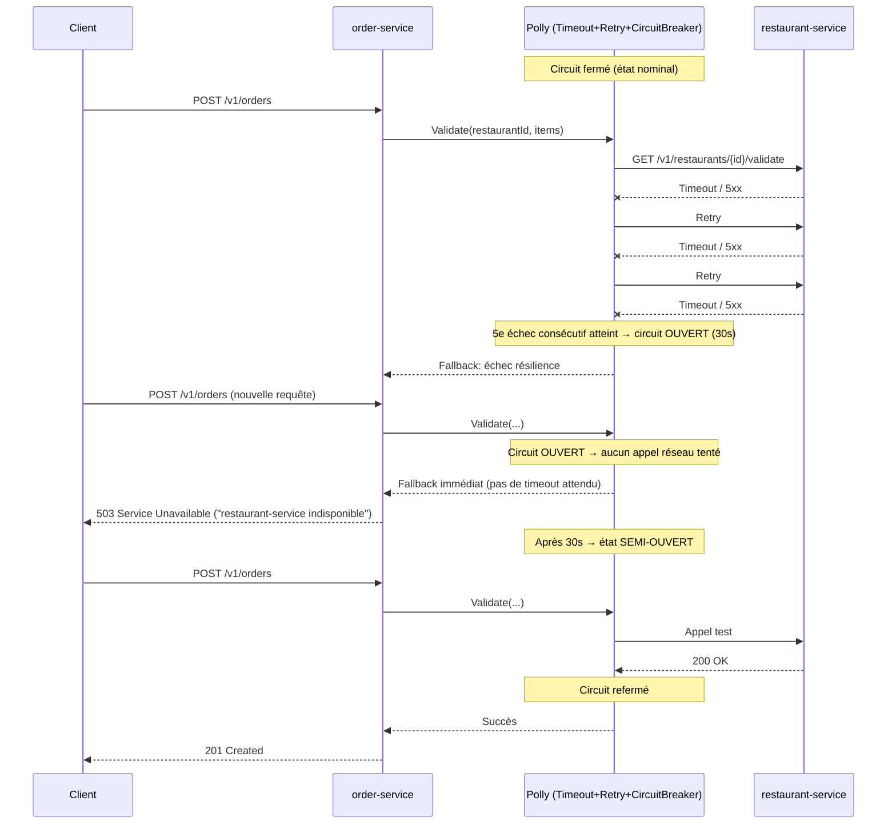

# Architecture Microservices — Plateforme de Livraison de Repas

## Sommaire

1. [Description générale](#1-description-générale)
2. [Analyse du domaine et découpage en Bounded Contexts](#2-analyse-du-domaine-et-découpage-en-bounded-contexts)
3. [Catalogue des microservices](#3-catalogue-des-microservices)
4. [Communication inter-services](#4-communication-inter-services)
5. [Contrats d'API](#5-contrats-dapi)
6. [Gestion des données et cohérence](#6-gestion-des-données-et-cohérence)
7. [Transaction distribuée : la SAGA "Passage de commande"](#7-transaction-distribuée--la-saga-passage-de-commande)
8. [Résilience](#8-résilience)
9. [API Gateway](#9-api-gateway)
10. [CQRS sur le Catalogue (extension bonus)](#10-cqrs-sur-le-catalogue-extension-bonus)
11. [Infrastructure et déploiement](#11-infrastructure-et-déploiement)
12. [Diagrammes](#12-diagrammes)
13. [Périmètre du prototype](#13-périmètre-du-prototype)

---

## 1. Description générale

La plateforme est décomposée en **microservices autonomes**, chacun propriétaire de ses données, qui
communiquent soit en **synchrone** (REST, pour les besoins de lecture/validation immédiate), soit en
**asynchrone** (événements via **Kafka**, pour la propagation d'état et l'orchestration de processus métier
longs). Un **API Gateway** (Ocelot) est le point d'entrée unique pour les clients (application mobile/web du
client, du restaurant et du livreur).

Le processus métier central — le **passage de commande** — traverse plusieurs services (Commande,
Paiement, Livraison) et doit rester cohérent sans transaction ACID distribuée : il est piloté par une
**SAGA en orchestration**, portée par le service Commande, avec compensation en cas d'échec (ex. remboursement
si aucun livreur n'est disponible).

Principes directeurs :

- **Un service, une base de données** — aucune base partagée entre services (pas de foreign key
  inter-service).
- **Autonomie** — chaque service peut être développé, déployé et mis à l'échelle indépendamment.
- **Cohérence éventuelle** assumée pour les données répliquées entre services (ex. projection du
  catalogue), au bénéfice du découplage et de la disponibilité.
- **Résilience par conception** — tout appel synchrone inter-service est protégé (Timeout, Retry,
  Circuit Breaker, Fallback).

---

## 2. Analyse du domaine et découpage en Bounded Contexts

### 2.1 Démarche DDD

Le domaine "livraison de repas" a été découpé en **Bounded Contexts** en identifiant les sous-domaines
métier portant un langage ubiquitaire propre et des règles de gestion qui évoluent à des rythmes différents :

| Sous-domaine | Type DDD | Langage ubiquitaire propre |
|---|---|---|
| Gestion Client | Support | Client, Adresse, Compte |
| Gestion Restaurant | Cœur (Core) | Restaurant, Menu, Plat, Horaires |
| Catalogue & Recherche | Support (dérivé) | Recherche, Filtre, Résultat |
| Gestion Commande | **Cœur (Core)** | Panier, Commande, Ligne de commande, Statut |
| Paiement | Générique | Transaction, Remboursement |
| Gestion Livreur & Livraison | **Cœur (Core)** | Livreur, Disponibilité, Course, Localisation |
| Évaluation | Support | Évaluation, Note, Commentaire |
| Notification | Générique | Notification, Canal, Modèle |

### 2.2 Justification du découpage en microservices

Le découpage suit une correspondance **1 Bounded Context → 1 (ou plusieurs) microservice(s)**, avec deux
écarts volontaires justifiés par la cohésion fonctionnelle et le couplage de lecture/écriture :

- **Catalogue & Recherche** est séparé de **Gestion Restaurant** bien qu'ils partagent le même sous-domaine
  conceptuel, car leurs **exigences non-fonctionnelles divergent fortement** : Restaurant est un service
  d'écriture transactionnelle à faible volumétrie (CRUD administré par le restaurateur), alors que
  Catalogue est un service de **lecture haute fréquence** (recherche, navigation client) qui a besoin
  d'un modèle dénormalisé et met à l'échelle indépendamment. C'est le point d'entrée du pattern **CQRS**
  (voir §10) : Restaurant = côté Commande (write), Catalogue = côté Requête (read).
- **Gestion Livreur** et **Gestion Livraison** restent un seul service (`delivery-service`) : le cycle de
  vie d'une livraison (disponibilité → proposition → acceptation → tracking → confirmation) est fortement
  couplé au livreur lui-même ; les séparer aurait introduit un couplage synchrone permanent entre deux
  services sans bénéfice de cohésion.
- **Évaluation** (`review-service`) est un Bounded Context à part entière : ses données (notes,
  commentaires) sont indépendantes du cycle de vie de la commande une fois celle-ci terminée, et son
  rythme d'évolution (ex. modération, agrégation de notes) diffère du reste.

Critères de cohésion utilisés pour valider chaque frontière :

1. **Autonomie transactionnelle** : chaque service doit pouvoir committer son propre changement d'état
   sans dépendre d'un verrou distribué.
2. **Couplage minimal** : un service ne doit connaître des autres que via leur contrat d'API/événements,
   jamais via leur schéma de données interne.
3. **Vitesse d'évolution homogène** : les règles de gestion d'un même service évoluent ensemble (ex. les
   règles de calcul du prix d'une commande n'ont pas le même rythme que les règles d'éligibilité d'un
   livreur).
4. **Équipe/responsabilité métier** : dans une organisation réelle, chaque service correspondrait à une
   équipe autonome (Restaurant, Commande, Paiement, Livraison...).

---

## 3. Catalogue des microservices

| # | Microservice | Bounded Context | Responsabilités | Modèle de données principal | Implémenté dans le prototype |
|---|---|---|---|---|---|
| 1 | `customer-service` | Gestion Client | Inscription/authentification, profil, adresses de livraison, historique de commandes (vue) | `Customer`, `Address` | Non (documenté uniquement) |
| 2 | `restaurant-service` | Gestion Restaurant | Profil restaurant, gestion du menu (plats/prix/options), horaires d'ouverture, accept/refuse commande | `Restaurant`, `MenuItem`, `OpeningHours` | **Oui** |
| 3 | `catalog-service` | Catalogue & Recherche | Recherche de restaurants/plats par localisation/cuisine, affichage menu détaillé (projection en lecture, CQRS) | `RestaurantView` (dénormalisé) | **Oui** |
| 4 | `order-service` | Gestion Commande | Panier, création de commande, calcul du prix total, **orchestration de la SAGA**, suivi de statut | `Order`, `OrderItem`, `OrderStatusHistory` | **Oui** |
| 5 | `payment-service` | Paiement | Intégration passerelle de paiement (mockée), remboursements (partiels/totaux) | `Payment`, `Refund` | **Oui** |
| 6 | `delivery-service` | Gestion Livreur & Livraison | Profil livreur, disponibilités, assignation à une commande, suivi de localisation (simulé), confirmation | `Courier`, `Delivery` | **Oui** |
| 7 | `review-service` | Évaluation | Évaluation restaurant/livreur par le client (+ optionnel : client par livreur/restaurant) | `Review` | Non (documenté uniquement) |
| 8 | `notification-service` | Notification | Envoi de notifications multi-canal (Email/Push/SMS simulés) déclenchées par les événements métier | `NotificationLog` | **Oui** |

> Le prototype implémente **6 services métier + l'API Gateway**, ce qui dépasse le minimum de 3 exigé par
> l'énoncé et permet de démontrer un scénario de bout en bout (SAGA + CQRS + résilience). `customer-service`
> et `review-service` sont conçus et documentés (contrat, modèle de données, position dans le domaine) mais
> non codés, car ils n'apportent pas de pattern architectural supplémentaire par rapport aux 6 services
> retenus.

### 3.1 Détail des responsabilités et modèles de données

#### `restaurant-service`
- **Responsabilités** : CRUD du profil restaurant, CRUD des menus (plats, prix, description, options),
  gestion des horaires, acceptation/refus d'une commande entrante, publication des événements de
  changement de menu/disponibilité pour la projection catalogue.
- **Modèle de données (simplifié)** :
  ```
  Restaurant { id, name, cuisineType, address, location{lat,lng}, isOpen, openingHours[] }
  MenuItem   { id, restaurantId, name, description, price, options[], available }
  ```

#### `catalog-service` (lecture, CQRS)
- **Responsabilités** : maintenir une vue dénormalisée et indexée pour la recherche (par localisation,
  type de cuisine, nom de plat), servir les pages de consultation. Alimenté exclusivement par les
  événements Kafka publiés par `restaurant-service` (jamais d'écriture directe).
- **Modèle de données (simplifié)** :
  ```
  RestaurantView { id, name, cuisineType, location, isOpen, menuItems[{id,name,price,available}] }
  ```

#### `order-service`
- **Responsabilités** : gestion du panier, création de la commande, calcul du prix total (sous-total +
  frais de livraison), **orchestration de la SAGA de passage de commande**, machine à état du statut de
  commande (Reçue → Confirmée → En préparation → En livraison → Livrée / Annulée).
- **Modèle de données (simplifié)** :
  ```
  Order { id, customerId, restaurantId, items[{menuItemId,name,unitPrice,qty}],
          subtotal, deliveryFee, total, status, courierId?, createdAt, statusHistory[] }
  ```

#### `payment-service`
- **Responsabilités** : autoriser/capturer un paiement via une passerelle externe mockée, effectuer un
  remboursement partiel ou total (utilisé en compensation SAGA).
- **Modèle de données (simplifié)** :
  ```
  Payment { id, orderId, amount, status(AUTHORIZED|CAPTURED|FAILED|REFUNDED), provider, createdAt }
  ```

#### `delivery-service`
- **Responsabilités** : gestion du profil livreur, disponibilités déclarées, réception des propositions de
  livraison, assignation du livreur le plus proche disponible, suivi de position simulé, confirmation de
  livraison.
- **Modèle de données (simplifié)** :
  ```
  Courier  { id, name, status(OFFLINE|AVAILABLE|BUSY), location{lat,lng} }
  Delivery { id, orderId, courierId?, status(PENDING|ASSIGNED|PICKED_UP|IN_TRANSIT|DELIVERED|FAILED) }
  ```

#### `notification-service`
- **Responsabilités** : consommer les événements métier (commande créée/confirmée/annulée, livraison
  assignée/terminée...) et simuler l'envoi de notifications Email/Push/SMS aux acteurs concernés
  (client, restaurant, livreur).
- **Modèle de données (simplifié)** :
  ```
  NotificationLog { id, recipientType, recipientId, channel(EMAIL|PUSH|SMS), template, sentAt }
  ```

#### `customer-service` *(documenté, non implémenté)*
```
Customer { id, name, email, phone, addresses[{label,street,city,lat,lng}] }
```

#### `review-service` *(documenté, non implémenté)*
```
Review { id, orderId, authorType(CUSTOMER|COURIER|RESTAURANT), targetType, targetId, rating, comment }
```

---

## 4. Communication inter-services

### 4.1 Principe général

| Scénario | Mode | Protocole | Justification |
|---|---|---|---|
| Client consulte le catalogue / menu | Synchrone | REST (via Gateway) | Réponse immédiate attendue par l'UI |
| `order-service` valide le menu/prix auprès de `restaurant-service` avant de créer la commande | Synchrone | REST + Polly (Timeout/Retry/Circuit Breaker) | Besoin d'une confirmation immédiate, mais ne doit pas faire planter le parcours si Restaurant est lent/indisponible → résilience |
| `order-service` demande le paiement | Asynchrone (commande) | Événement Kafka (`payment.commands`) | Le paiement peut prendre du temps (appel passerelle externe) ; découplage temporel |
| `payment-service` notifie le résultat du paiement | Asynchrone | Événement Kafka (`payment.events`) | `order-service` réagit quand le résultat est prêt, pas de blocage |
| `order-service` demande l'assignation d'un livreur | Asynchrone (commande) | Événement Kafka (`delivery.commands`) | L'assignation dépend de la disponibilité en temps réel, latence variable |
| `delivery-service` notifie l'assignation/l'échec | Asynchrone | Événement Kafka (`delivery.events`) | Idem |
| Propagation des changements de menu vers le catalogue | Asynchrone | Événement Kafka (`restaurant.events`) | CQRS : la projection de lecture se reconstruit en tâche de fond, cohérence éventuelle acceptable |
| Diffusion des changements de statut aux clients/restaurants/livreurs | Asynchrone | Événement Kafka (`order.events`, `delivery.events`) → `notification-service` | Fan-out vers plusieurs canaux, ne doit jamais bloquer le flux métier principal |

**Règle générale retenue** : le **synchrone** est utilisé uniquement pour les lectures (consultation) et
pour une validation ponctuelle nécessitant une réponse immédiate côté écriture (et toujours protégé par des
patterns de résilience). Tout ce qui relève de la **propagation d'état** ou de **l'orchestration d'un
processus métier multi-étapes** passe par des **événements Kafka**, qui apportent découplage temporel,
tolérance aux pannes transitoires et rejouabilité.

### 4.2 Topics Kafka

| Topic | Producteur | Consommateur(s) | Clé de partition | Contenu |
|---|---|---|---|---|
| `restaurant.events` | restaurant-service | catalog-service | `restaurantId` | `RestaurantCreated`, `MenuItemUpserted`, `MenuItemRemoved`, `RestaurantAvailabilityChanged` |
| `payment.commands` | order-service | payment-service | `orderId` | `ProcessPayment`, `RefundPayment` |
| `payment.events` | payment-service | order-service, notification-service | `orderId` | `PaymentSucceeded`, `PaymentFailed`, `PaymentRefunded` |
| `delivery.commands` | order-service | delivery-service | `orderId` | `AssignCourier` |
| `delivery.events` | delivery-service | order-service, notification-service | `orderId` | `CourierAssigned`, `NoCourierAvailable`, `DeliveryStatusChanged`, `DeliveryCompleted` |
| `order.events` | order-service | notification-service, restaurant-service | `orderId` | `OrderCreated`, `OrderConfirmed`, `OrderCancelled`, `OrderCompleted` |

**Choix de conception Kafka (bonus)** :
- **Partitionnement par `orderId`/`restaurantId`** : garantit l'ordre des événements relatifs à une même
  commande ou un même restaurant (Kafka ne garantit l'ordre qu'à l'intérieur d'une partition), sans exiger
  une seule partition globale.
- **Consumer groups dédiés par service** (`order-service-cg`, `catalog-service-cg`,
  `notification-service-cg`, ...) : chaque service consomme indépendamment et à son propre rythme ; un
  service lent ne ralentit pas les autres. Plusieurs instances d'un même service partagent un groupe pour
  scaler horizontalement (répartition des partitions).
- **Garantie de livraison retenue : *at-least-once***. Les producteurs utilisent `acks=all` sur les topics
  critiques (`payment.*`, `delivery.*`) pour ne pas perdre d'événement en cas de bascule de leader. En
  contrepartie, un même événement peut être livré plusieurs fois (ex. après un rebalance) : les
  consommateurs sont conçus **idempotents** (déduplication par `eventId` déjà traité, et les transitions de
  statut sont des mises à jour idempotentes — passer `Order.status` à `PAID` deux fois n'a pas d'effet de
  bord).
- *(Exactly-once via transactions Kafka a été jugé disproportionné pour la volumétrie et la criticité de
  ce projet pédagogique — voir [ADR-0002](adr/0002-communication-asynchrone-kafka.md)).*

---

## 5. Contrats d'API

Les contrats OpenAPI complets des services clés sont fournis dans [`docs/api/`](api/) :

- [`order-service.yaml`](api/order-service.yaml) — panier, commande, suivi de statut
- [`payment-service.yaml`](api/payment-service.yaml) — paiement, remboursement
- [`restaurant-service.yaml`](api/restaurant-service.yaml) — profil, menu, horaires, accept/refuse
- [`catalog-service.yaml`](api/catalog-service.yaml) — recherche, consultation (lecture CQRS)
- [`delivery-service.yaml`](api/delivery-service.yaml) — livreurs, disponibilité, assignation, tracking

### 5.1 Conventions communes

- Format **JSON**, `Content-Type: application/json`.
- Codes de retour standards : `200` (OK), `201` (créé), `202` (accepté / traitement async engagé),
  `400` (requête invalide), `404` (ressource introuvable), `409` (conflit d'état, ex. commande déjà
  annulée), `503` (dépendance indisponible — utilisé par le Circuit Breaker, voir §8).
- Pagination par `page`/`pageSize` sur les endpoints de liste.
- Erreurs au format uniforme `{ "error": { "code": "...", "message": "..." } }`.

### 5.2 Versionnement et rétrocompatibilité

- **Versionnement dans l'URL** : `/v1/...` sur chaque service exposé par la Gateway. Un changement
  incompatible (breaking change) donne lieu à un nouveau préfixe `/v2/...` déployé en parallèle, jamais à
  une modification en place.
- **Règles de compatibilité ascendante** au sein d'une version majeure : on peut ajouter un champ optionnel
  ou un endpoint, jamais supprimer/renommer un champ existant ni changer son type.
- Les **événements Kafka** portent un champ `eventVersion` et `eventType` explicite (ex.
  `OrderCreated.v1`) ; un changement de forme incompatible crée un nouveau type d'événement plutôt que de
  modifier le précédent, pour ne pas casser les consommateurs existants (schéma "tolerant reader" côté
  consommateurs : ils ignorent les champs inconnus).

---

## 6. Gestion des données et cohérence

- **Base de données par service** : chaque service possède son propre stockage logique et ne l'expose
  jamais directement (dans le prototype : stockage en mémoire pour simuler cette isolation sans complexifier
  le déploiement ; en production, chaque service aurait sa propre instance PostgreSQL/MongoDB — voir
  [ADR-0007](adr/0007-pas-de-bdd-partagee.md)).
- **Pas de jointure inter-service en base** : toute donnée nécessaire à un service mais possédée par un
  autre est soit demandée via API synchrone (cas de lecture ponctuelle), soit répliquée localement via
  événements (cas de lecture fréquente, ex. `catalog-service`).
- **Cohérence éventuelle assumée** pour les données répliquées : après une mise à jour de menu, la
  projection `catalog-service` peut être en retard de quelques centaines de millisecondes (fenêtre de
  propagation Kafka). Acceptable car ce n'est pas une donnée engageant une transaction financière.
- **Cohérence forte requise** uniquement au sein d'un même service (ex. le statut d'une `Order` est géré de
  façon strictement séquentielle par `order-service`, seul propriétaire de cette donnée).
- **Processus multi-services nécessitant une cohérence globale** (paiement + assignation livreur au sein
  d'une commande) → géré par la **SAGA** décrite ci-dessous, qui remplace la transaction distribuée
  classique (2PC), écartée pour son couplage fort et son incompatibilité avec la disponibilité recherchée.

---

## 7. Transaction distribuée : la SAGA "Passage de commande"

### 7.1 Pourquoi une SAGA

Le passage de commande touche trois services indépendants (Commande, Paiement, Livraison) qui ne partagent
pas de base de données : impossible d'utiliser une transaction ACID classique. On utilise le pattern
**SAGA**, qui décompose le processus en une suite d'étapes locales, chacune avec une **action compensatoire**
en cas d'échec plus loin dans la chaîne.

### 7.2 Choix : Orchestration (plutôt que Chorégraphie)

`order-service` joue le rôle d'**orchestrateur** : il connaît explicitement la séquence des étapes, envoie
des **commandes** aux autres services et réagit à leurs **événements de résultat**. Voir justification
détaillée dans [ADR-0003](adr/0003-saga-orchestration.md) — en résumé : un seul endroit centralise la
logique du processus (plus facile à tester, tracer et faire évoluer), au prix d'un couplage de
l'orchestrateur vers les autres services (acceptable ici car `order-service` est déjà le service métier
central du processus).

### 7.3 Déroulé (happy path)

1. Le client crée une commande → `order-service` valide le menu/les prix auprès de `restaurant-service`
   (appel REST résilient), crée `Order{status=CREATED}`, publie `OrderCreated`.
2. `order-service` envoie la commande `ProcessPayment` sur `payment.commands`.
3. `payment-service` traite le paiement (mock), publie `PaymentSucceeded` sur `payment.events`.
4. `order-service` consomme `PaymentSucceeded` → `Order.status=PAID` → envoie `AssignCourier` sur
   `delivery.commands`.
5. `delivery-service` trouve un livreur disponible, publie `CourierAssigned`.
6. `order-service` consomme `CourierAssigned` → `Order.status=CONFIRMED`, publie `OrderConfirmed`.
7. `notification-service` notifie client/restaurant/livreur à chaque étape (2, 4, 6).
8. Plus tard : `delivery-service` publie les changements de statut (`PICKED_UP`, `IN_TRANSIT`,
   `DELIVERED`) → `order-service` met à jour `Order.status` en conséquence → notifications.

### 7.4 Scénarios d'échec et compensation

| Étape en échec | Détection | Action compensatoire |
|---|---|---|
| Paiement refusé | `PaymentFailed` reçu par `order-service` | `Order.status=CANCELLED`, publication `OrderCancelled`, notification client — **aucune compensation en amont nécessaire** (rien n'a encore été engagé) |
| Aucun livreur disponible | `NoCourierAvailable` reçu par `order-service` | Envoi de `RefundPayment` sur `payment.commands` (**compensation** de l'étape 2-3), attente `PaymentRefunded`, puis `Order.status=CANCELLED`, notification client + restaurant |
| Timeout d'une étape (pas de réponse dans le délai imparti) | Timer applicatif côté `order-service` (ex. 30s sans `PaymentSucceeded`/`PaymentFailed`) | Traité comme un échec de l'étape → même compensation que ci-dessus |

Le détail visuel de ce flux (happy path + compensation) est fourni au [§12.3](#123-séquence--saga-passage-de-commande-happy-path-et-compensation).

---

## 8. Résilience

### 8.1 Points de défaillance identifiés

| Dépendance | Risque | Impact si non traité |
|---|---|---|
| Appel synchrone `order-service` → `restaurant-service` (validation menu/prix) | Restaurant Service lent ou indisponible | Blocage de la création de commande, épuisement des threads/connexions de `order-service` (effet cascade) |
| Broker Kafka temporairement indisponible | Panne infra | Commandes/événements non publiés |
| `payment-service` (passerelle externe mockée) | Latence/panne du prestataire de paiement | Commande bloquée en attente de paiement |

Le prototype se concentre sur le premier point, le plus représentatif d'un appel **synchrone** entre deux
services (le broker Kafka gère nativement la résilience de bout en bout des flux asynchrones par sa
persistance des messages).

### 8.2 Pattern implémenté : Circuit Breaker + Retry + Timeout + Fallback (Polly, .NET)

Sur l'appel `order-service → restaurant-service` :

- **Timeout** : 2 secondes par tentative — évite qu'un appel lent ne bloque indéfiniment le thread appelant.
- **Retry** : jusqu'à 3 tentatives avec backoff exponentiel (200ms, 400ms, 800ms) sur les échecs
  transitoires (timeout, 5xx, erreur réseau) — absorbe les pannes courtes.
- **Circuit Breaker** : après 5 échecs consécutifs, le circuit s'**ouvre** pendant 30 secondes (aucun appel
  n'est tenté, échec immédiat) puis passe en **semi-ouvert** pour un appel test — protège
  `restaurant-service` d'une surcharge pendant qu'il récupère, et évite à `order-service` d'attendre
  inutilement des timeouts à répétition.
- **Fallback** : si le circuit est ouvert ou si toutes les tentatives échouent, `order-service` renvoie
  immédiatement `503 Service Unavailable` avec un message explicite au client (« Le service restaurant est
  momentanément indisponible, merci de réessayer ») plutôt que de laisser la requête s'éterniser ou de
  planter.

Voir le diagramme de séquence dédié au [§12.4](#124-séquence--circuit-breaker-sur-lappel-order-service--restaurant-service)
et l'implémentation dans [`src/OrderService/Resilience/RestaurantClient.cs`](../src/OrderService/Resilience/RestaurantClient.cs).

---

## 9. API Gateway

Un **API Gateway** (Ocelot, .NET) constitue le point d'entrée unique pour les clients externes
(applications client/restaurant/livreur) :

- **Routage** : redirige chaque requête entrante vers le microservice interne approprié
  (`/v1/restaurants/**` → `restaurant-service`, `/v1/orders/**` → `order-service`, etc.), en masquant la
  topologie interne (les clients ne connaissent jamais l'adresse d'un service en particulier).
- **Point d'agrégation potentiel (BFF)** : si un écran client a besoin de données de plusieurs services
  (ex. détail commande + position du livreur), la Gateway peut agréger plusieurs appels — non implémenté
  dans le prototype (hors périmètre "démonstration"), mais l'architecture le permet.
- **Emplacement naturel des préoccupations transverses** : authentification/autorisation, rate limiting,
  logging centralisé, versionnement d'API — non implémentés dans le prototype pédagogique mais évoqués
  comme extension naturelle.
- Les services métier ne sont **pas exposés directement** à l'extérieur du réseau Docker ; seule la
  Gateway publie un port hôte.

---

## 10. CQRS sur le Catalogue (extension bonus)

**Contexte du chapitre 9** : le Catalogue est un cas d'usage typique de CQRS car ses profils de lecture et
d'écriture sont radicalement différents (peu d'écritures administratives vs. beaucoup de lectures de
recherche/navigation).

- **Côté Commande (write)** : `restaurant-service` reste l'unique source de vérité pour un restaurant et
  son menu. Toute modification (création de plat, changement de prix, ouverture/fermeture) est validée et
  persistée ici, puis publiée comme événement de domaine sur `restaurant.events`.
- **Côté Requête (read)** : `catalog-service` ne possède **aucune écriture directe exposée aux clients** —
  il consomme `restaurant.events` en tâche de fond et maintient une **projection dénormalisée**
  (`RestaurantView`) optimisée pour les patterns de lecture réels : recherche par localisation/type de
  cuisine, recherche de plat, affichage d'un menu complet en un seul appel (pas de jointure au moment de la
  requête).
- **Reconstruction de la projection** : en cas de perte du read-model, `catalog-service` peut être
  entièrement reconstruit en rejouant `restaurant.events` depuis le début du topic (`offset=earliest`) —
  bénéfice direct d'avoir Kafka comme journal durable des événements.
- **Cohérence** : éventuelle, avec un délai de propagation typiquement inférieur à la seconde. Documenté
  comme compromis assumé (voir [ADR-0006](adr/0006-cqrs-catalogue.md)).

---

## 11. Infrastructure et déploiement

Le prototype est packagé avec **Docker Compose** (voir [`docker-compose.yml`](../docker-compose.yml)) :

- 1 broker **Kafka** (mode KRaft, sans Zookeeper) + **Kafka UI** (Provectus) pour visualiser topics,
  partitions et consumer groups pendant la démo.
- 6 microservices .NET (`restaurant-service`, `catalog-service`, `order-service`, `payment-service`,
  `delivery-service`, `notification-service`), chacun dans son propre conteneur, stockage en mémoire.
- 1 **API Gateway** (Ocelot), seul service exposant un port sur l'hôte pour les appels REST externes.
- Réseau Docker dédié (`foodapp-net`), les services communiquent par nom DNS de conteneur.

```
docker compose up --build
```

Chaque service est indépendamment buildable/déployable (Dockerfile propre), conformément au principe
d'autonomie des microservices — Compose ne sert ici qu'à simuler l'orchestration multi-conteneurs pour la
démonstration locale (en production, on viserait Kubernetes).

---

## 12. Diagrammes

### 12.1 Diagramme de contexte système (niveau 1)



### 12.2 Diagramme de conteneurs (niveau 2)

```mermaid
flowchart TB
    subgraph Clients
        C[App Client]
        R[App Restaurant]
        L[App Livreur]
    end

    GW["API Gateway (Ocelot)"]

    subgraph Services métier
        RS["restaurant-service"]
        CS["catalog-service (CQRS read)"]
        OS["order-service (orchestrateur SAGA)"]
        PS["payment-service"]
        DS["delivery-service"]
        NS["notification-service"]
    end

    K[("Kafka\n(broker événementiel)")]
    PayExt[["Passerelle de paiement externe (mock)"]]
    NotifExt[["Email / SMS / Push (simulés)"]]

    C -->|REST| GW
    R -->|REST| GW
    L -->|REST| GW

    GW -->|REST /v1/restaurants| RS
    GW -->|REST /v1/catalog| CS
    GW -->|REST /v1/orders| OS
    GW -->|REST /v1/payments| PS
    GW -->|REST /v1/delivery| DS

    OS -->|REST résilient\n(Timeout/Retry/CB)| RS

    RS -->|publie| K
    K -->|restaurant.events| CS

    OS -->|payment.commands| K
    K -->|payment.commands| PS
    PS -->|payment.events| K
    K -->|payment.events| OS

    OS -->|delivery.commands| K
    K -->|delivery.commands| DS
    DS -->|delivery.events| K
    K -->|delivery.events| OS

    OS -->|order.events| K
    K -->|order.events / payment.events / delivery.events| NS

    PS -.->|appel mocké| PayExt
    NS -.->|envoi simulé| NotifExt

    style K fill:#2b2b2b,color:#fff
```

### 12.3 Séquence — SAGA "Passage de commande" (happy path et compensation)



### 12.4 Séquence — Circuit Breaker sur l'appel order-service → restaurant-service



---

## 13. Périmètre du prototype

Conformément à l'énoncé (« démonstration des choix d'architecture, pas un produit complet »), le prototype :

- Implémente **6 microservices + 1 API Gateway**, tous avec des **API mockées** (données en mémoire, pas de
  logique métier complexe, pas de base de données réelle).
- Démontre **explicitement dans le code** :
  - la **SAGA en orchestration** (happy path + une compensation : remboursement si aucun livreur
    disponible),
  - le **pattern de résilience** Circuit Breaker/Retry/Timeout/Fallback (Polly) sur l'appel
    `order-service → restaurant-service`,
  - le **CQRS** (write model `restaurant-service` / read model `catalog-service` synchronisés par
    événements Kafka).
- Fournit un `docker-compose.yml` unique lançant Kafka + Kafka UI + les 7 conteneurs applicatifs.
- Ne couvre pas : authentification réelle, paiement réel, persistance réelle, `customer-service` et
  `review-service` (documentés mais non codés — voir §3), UI graphique (démonstration via requêtes HTTP/
  Swagger UI).

Voir le [README](../README.md) pour les instructions de lancement et de démonstration du scénario complet.
