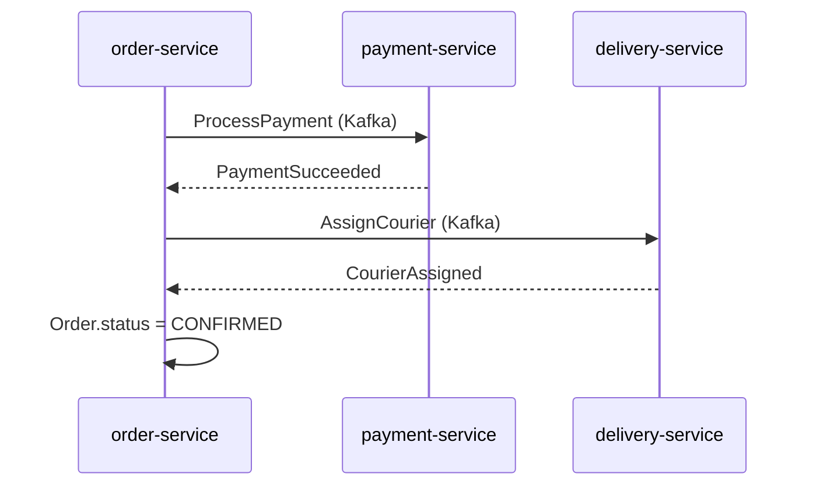
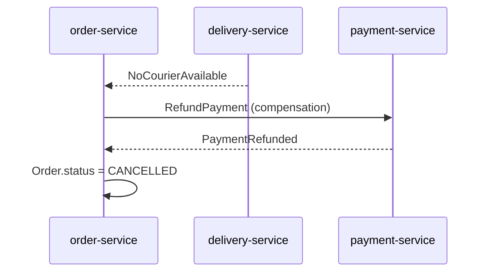

# Architecture Microservices
## Plateforme de Livraison de Repas

Conception, documentation et prototype d'une architecture microservices
type Uber Eats / Deliveroo

---

## Sommaire

1. Contexte métier et objectifs
2. Découpage en microservices (DDD)
3. Communication inter-services (REST / Kafka)
4. La SAGA "Passage de commande" (orchestration)
5. Résilience : Circuit Breaker (Polly)
6. CQRS sur le catalogue (bonus)
7. Infrastructure & démonstration du prototype

---

## Contexte métier

- Clients : parcourent les restaurants, commandent, paient, suivent la livraison
- Restaurants : gèrent menus, horaires, acceptent/refusent les commandes
- Livreurs : déclarent leurs disponibilités, acceptent des livraisons

**Objectif du projet** : concevoir l'architecture et **prouver par un prototype**
que les choix (communication, SAGA, résilience) fonctionnent — pas livrer un
produit complet.

---

## Découpage en Bounded Contexts (DDD)

| Bounded Context | Type | Microservice |
|---|---|---|
| Gestion Restaurant | Cœur | `restaurant-service` |
| Catalogue & Recherche | Support (dérivé, CQRS) | `catalog-service` |
| Gestion Commande | **Cœur** | `order-service` |
| Paiement | Générique | `payment-service` |
| Gestion Livreur/Livraison | **Cœur** | `delivery-service` |
| Notification | Générique | `notification-service` |
| Client / Évaluation | Support | conçus, non codés |

---

## Pourquoi séparer Restaurant et Catalogue ?

- `restaurant-service` : **écriture** transactionnelle, faible volumétrie (CRUD administré par le restaurateur)
- `catalog-service` : **lecture** haute fréquence (recherche/navigation client), modèle dénormalisé

→ Profils non-fonctionnels trop différents pour un seul service : c'est notre
terrain pour le pattern **CQRS** (voir plus loin).

*Critères de découpage : autonomie transactionnelle, couplage minimal, vitesse
d'évolution homogène — détaillés dans `docs/architecture.md` §2 et `ADR-0001`.*

---

## Communication inter-services

| Scénario | Mode | Pourquoi |
|---|---|---|
| Lecture / consultation | **REST synchrone** | Réponse immédiate attendue |
| Validation menu/prix (order → restaurant) | **REST + résilience** | Réponse immédiate mais ne doit jamais bloquer en cascade |
| Paiement, assignation livreur | **Kafka (commandes)** | Latence variable, ne doit pas bloquer l'appelant |
| Propagation d'état (menu → catalogue) | **Kafka (événements)** | Cohérence éventuelle acceptable |
| Notifications | **Kafka (événements)** | Fan-out, ne doit jamais impacter le flux métier |

---

## Topics Kafka

```
restaurant.events   → catalog-service (projection CQRS)
payment.commands    → payment-service
payment.events      → order-service, notification-service
delivery.commands   → delivery-service
delivery.events     → order-service, notification-service
order.events        → notification-service, restaurant-service
```

- Partitionnement par `orderId` / `restaurantId` (ordre garanti par agrégat)
- Un **consumer group dédié par service**
- Garantie **at-least-once** (`acks=all`) + **consommateurs idempotents**

---

## La SAGA "Passage de commande"

Le passage de commande traverse 3 services sans BDD partagée → pas de
transaction ACID distribuée possible.

**Choix : SAGA en orchestration**, portée par `order-service`.

- Un seul endroit centralise la logique du processus (traçable, testable)
- `order-service` envoie des **commandes** (Kafka), réagit aux **événements**
  de résultat

*Chorégraphie écartée pour ce processus : logique diffusée entre services,
plus difficile à tracer pour un flux aussi critique (paiement + logistique).*

---

## SAGA — déroulé nominal



CREATED → AWAITING_PAYMENT → PAID → AWAITING_COURIER → CONFIRMED →
IN_PREPARATION → IN_DELIVERY → DELIVERED

---

## SAGA — compensation

**Cas : aucun livreur disponible après paiement capturé**



→ La compensation annule l'effet du paiement déjà capturé, sans transaction
distribuée classique.

---

## Résilience — Circuit Breaker (Polly)

Appel synchrone `order-service → restaurant-service` (validation avant
commande) = seul point de couplage synchrone fort → risque de panne en cascade.

**CircuitBreaker(Retry(Timeout(appel HTTP)))**

- **Timeout** 2s par tentative
- **Retry** ×3, backoff exponentiel 200/400/800ms
- **Circuit Breaker** ouvre après 5 échecs consécutifs, 30s avant semi-ouverture
- **Fallback** → 503 immédiat au lieu de laisser la requête s'éterniser

---

## Résilience — pourquoi cet ordre de policies ?

- Si Retry était **au-dessus** du Circuit Breaker : chaque retry re-déclenche
  le check du disjoncteur → risque de "retry storm" sur un service déjà en
  difficulté
- Avec **CircuitBreaker au-dessus** : il ne voit qu'**un seul résultat** par
  appel logique (déjà retryé) → protège vraiment `restaurant-service`
  pendant sa récupération

*Voir `ADR-0004` et diagramme de séquence `architecture.md` §12.4*

---

## CQRS sur le Catalogue (bonus)

- **Côté Commande** : `restaurant-service` reste l'unique source de vérité
- **Côté Requête** : `catalog-service` maintient une projection dénormalisée,
  alimentée **exclusivement** par les événements `restaurant.events`
- Aucune écriture directe exposée côté catalogue
- **Rejouable** : reconstruction complète possible en rejouant le topic depuis
  `offset=earliest`

Compromis assumé : cohérence éventuelle (délai de propagation ~qqs centaines
de ms), acceptable car non-financier.

---

## API Gateway (Ocelot)

- Point d'entrée unique pour les clients externes
- Masque la topologie interne (routage `/v1/orders/**` → `order-service`, etc.)
- Emplacement naturel pour les préoccupations transverses (auth, rate limiting
  — non implémentées dans le prototype pédagogique)
- Seuls la Gateway expose un port sur l'hôte ; les microservices restent
  internes au réseau Docker

---

## Prototype — ce qui est implémenté

**6 microservices + API Gateway**, C#/.NET 8, API mockées (stockage en
mémoire), démontrant explicitement :

- La **SAGA en orchestration** (happy path + compensation)
- Le **Circuit Breaker** (Polly) sur l'appel synchrone critique
- Le **CQRS** (write `restaurant-service` / read `catalog-service`)

```bash
docker compose up --build
```

Kafka (KRaft) + Kafka UI (localhost:8090) + 6 services + Gateway (localhost:8080)

---

## Démonstration

1. **Happy path** : `POST /v1/orders` → suivi via `GET /v1/orders/{id}/status`
2. **Compensation** : `POST /v1/_chaos/force-no-courier` sur delivery-service →
   nouvelle commande → remboursement automatique observable dans Kafka UI
3. **Circuit Breaker** : `POST /v1/_chaos/enable` sur restaurant-service →
   plusieurs commandes → logs `order-service` montrant l'ouverture du circuit
4. **CQRS** : ajout d'un plat sur `restaurant-service` → apparition différée
   dans `catalog-service`

---

## Limites assumées du prototype

- Stockage en mémoire (pas de persistance réelle) — permis par l'énoncé
- `customer-service` et `review-service` conçus mais non codés (n'apportent
  pas de pattern supplémentaire par rapport aux 6 services retenus)
- Pas d'authentification, pas de paiement réel, pas d'UI graphique

Détails complets, ADRs et contrats OpenAPI : voir `docs/`

---

# Questions ?

Documentation : `docs/architecture.md`
Code : `src/`
Démo : `docker compose up --build`
